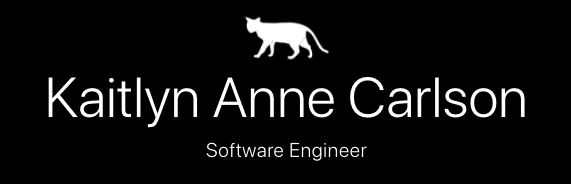

# Kaitlyn Carlson

[Portfolio](https://kaitlyncarlson.github.io/React-Portfolio/)

Ambitious Software Engineer with a certificate in Full Stack Web Development from the University of Washington, as well as a Bachelor of Arts in English from Bloomsburg University of Pennsylvania. Previous work experience has been focused in marketing and customer facing roles which enables my development of useful applications that have a strong focus on consumer needs and desires. Technical skills in the MERN stack with knowledge of both SQL and NoSQL databases.

Proven track record of effective collatoration on a team to achieve exemplary results. Mothra Project Management Tracker is one such project that utilizes JavaScript, NodeJS and a SQL database to create a useful and effective project management tool for users. An application that easily organizes projects, tasks and teams while tracking task status with ChartJS.

Versatile skills in idea synthesis, creative problem solving, and the ability to thrive in high-pressure environments

## Technologies Used for Portfolio

- JavaScript
- React
- HTML
- CSS
- BootStrap
- Font Awesome
- gh-pages

## Learn More

[Visit me on LinkedIn](https://www.linkedin.com/in/kaitlynannecarlson/)
